# Python 基础知识

## 1 注释

### 1.1 什么是注释

注释是对代码的解释说明，面向程序员，代码执行时不生效，不影响程序结构。

### 1.2 注释的作用

- 提高代码的可读性
- 屏蔽暂时不需要的代码
- 定位程序中出错的位置

### 1.3 单行注释

Python 中 `#` 后的一行内容为注释，官方建议：

- `#` 与注释内容间加一个空格
- 语句与 `#` 间加两个空格

示例：

```python
# 注释内容
# print("hello world1")
print("hello world2")  # 将会打印
```

### 1.4 多行注释

用三个单 / 双引号包裹，支持换行，不可嵌套（本质是多行字符串）。

示例：

```python
"""
注释内容
注释内容
注释内容
"""
# 作为字符串使用时会被执行
print(
    """
	注释内容
    """
)
```


## 2 变量

### 2.1 什么是变量

程序执行过程中值可改变的量，内存中分配存储空间，通过变量名关联内存地址，用于标记和存储数据。

### 2.2 变量的创建

- 语法：`变量名 = 变量值`（无需声明，赋值后创建）

```python
# 定义单个变量
a = 1
var2 = 10
result = a + var2
print("以下为打印结果：")
print(a)
print(var2)
print(result)
```

- 多变量创建：

```python
# 定义多个变量 字符串可以与字符串相加，会合并字符串。数字不能与字符串相加，不能直接合并
x,y,z = "我是x","我是y","我是z"
print("以下为打印结果："+x)
print(y)
print(z)

q1 = q2 = q3 = 100
print(q1)
print(q2)
print(q3)
qa = q1 + q2 + q3
print(qa)
print(q1 + q2 + q3)

# python中定义变量，不建议重名，如果同一个变量多次赋值，不会报错，而是数值覆盖
# 将定义变量与赋值变量两个动作合在一起执行
a = 200
print(a)
```

#### 2.1 标识符命名规则

1. **标识符**：程序中可自定义命名的部分（变量名称、函数名称等）

2. 命名规则

   - 仅含字母、数字、下划线，不能以数字开头
   - 区分大小写（`Name` 和 `name` 是不同标识符）
   - 不与关键字重复
   - 简短且具描述性

3. **关键字**：Python 保留字，不可用作标识符

   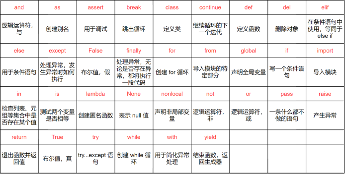

   可以通过命令查看关键字:

   ```python
   import keyword
   print(keyword.kwlist)
   ```

   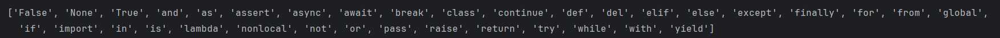

4. 命名方法

   - 大驼峰：`UpperCamelCase`（每个单词首字母大写）
   - 小驼峰：`lowerCamelCase`（首个单词首字母小写，后续大写）
   - 蛇形：`snake_case`（单词间用下划线连接）

#### 2.2 变量的修改

可随时修改值，支持变量互换。

示例：

```python
message = "hello world"
print(message)  # 输出hello world
message = "hello world hello world"
print(message)  # 输出修改后内容

# 变量互换
var1 = 2
var2 = 20
var1, var2 = var2, var1
print(var1, var2)  # 输出20 2
```


#### 2.3 常量

定义后不修改的值，Python 无内置常量类型，约定用全大写命名,多个单词用下划线连接

示例：

```python
PI = 3.14
MY_PI = 3.14
E = 2.71828
```

## 3 机器码

### 3.1 进制

计算机存储和运算的所有数据均为二进制，常见进制：

| 进制     | 组成                     | 进位规则   |
| -------- | ------------------------ | ---------- |
| 二进制   | 0、1                     | 满 2 进 1  |
| 八进制   | 0-7                      | 满 8 进 1  |
| 十进制   | 0-9                      | 满 10 进 1 |
| 十六进制 | 0-9、A-F（不区分大小写） | 满 16 进 1 |

### 3.2 不同进制表示整数

- 二进制：以 `0b`/`0B` 开头（如 `0b1010`）
- 八进制：以 `0o` 开头（如 `0o12`）
- 十进制：直接书写（如 `10`）
- 十六进制：以 `0x`/`0X` 开头（如 `0xA`）

进制转换函数：

- `bin(x)`：十进制转二进制
- `oct(x)`：十进制转八进制
- `hex(x)`：十进制转十六进制

```python
my_number = 10
print(bin(my_number))  # 输出0b1010
print(oct(my_number))  # 输出0o12
print(hex(my_number))  # 输出0xa
```


### 3.3 八四二一法二进制转换成十进制

规则：二进制最后四位为十进制的8，4，2，1。

示例：

​	二进制:  

​	1011  >>  8 + 2 + 1 = 11

​	1101  >>  8 + 4 + 1 = 13

​	1001 1101一个字节最多存储256个数字，最大能存储255

### 3.4 原码、反码、补码

1. **机器数**：数字在计算机中的二进制表示，最高位为符号位（0 = 正，1 = 负)，以字节为基本单位，1字节=8位

2. **真值**：机器数对应的实际数值（需考虑符号位）

3. 原码

     符号位 + 数值绝对值（正数、0 的原码为自身二进制，负数符号位为 1）

   - 示例：`+1` 原码 `0000 0001`，`-1` 原码 `1000 0001`

4. 反码

   - 正数：与原码相同
   - 负数：符号位不变，其余位取反
   - 示例：`-1` 反码 `1111 1110`

5. 补码

   - 正数、0：与原码、反码相同
   - 负数：反码 + 1
   - 示例：`-1` 补码 `1111 1111`

### 3.5 计算机为什么用补码

- 统一正负数的运算规则（减法转加法）
- 避免 0 的二义性（原码 / 反码中 0 有 + 0 和 - 0，补码中 0 唯一）

### 3.6 补码计算案例：18 - 21

#### 3.6.1 规则回顾

- 正数：原码 = 反码 = 补码
- 负数：反码 = 原码（符号位不变，其余位取反）；补码 = 反码 + 1
- 符号位：最高位（第 8 位），0 = 正，1 = 负

#### 3.6.2 将十进制数转为 8 位二进制原码

- 原码

| 数值 | 十进制转二进制（无符号） | 8 位原码（符号位 + 数值） | 说明             |
| ---- | ------------------------ | ------------------------- | ---------------- |
| 18   | 18 = 16 + 2 = 10010      | `0001 0010`               | 正数，符号位为 0 |
| -21  | 21 = 16 + 4 + 1 = 10101  | `1001 0101`               | 负数，符号位为 1 |

- -21 的补码

  ```
  1001 0101  >>  1110 1010 >> 1110 1011
  ```

- 补码相加（18 的补码 + -21 的补码）

```plaintext
    0001 0010
  + 1110 1011
  -----------
    1111 1101  （补码结果，最高位进位舍弃，8位保留）
```

- 结果转回原码

补码结果：`1111 1101`（最高位为 1，说明是负数）

```
补码 - 1 得到反码
1111 1101 >> 1111 1100
符号位不变，其余取反，得到原码(真值)
1111 1100 >> 1000 0011 >> 十进制 -3
```

- 整体过程如下

```plaintext
┌─────────────────────────────────────────────────┐
│  计算流程：18 - 21 = 18 + (-21)                  │
├─────────────┬─────────────┬─────────────┬────────┤
│  步骤       │ 18（正数）  │ -21（负数） │ 运算结果 │
├─────────────┼─────────────┼─────────────┼────────┤
│  1. 原码    │ 0001 0010   │ 1001 0101   │ -      │
│  2. 反码    │ 0001 0010   │ 1110 1010   │ -      │
│  3. 补码    │ 0001 0010   │ 1110 1011   │ -      │
│  4. 补码相加 │ -           │ -           │ 1111 1101（补码） │
│  5. 补码转反码 │ -        │ -           │ 1111 1100（反码） │
│  6. 反码转原码 │ -        │ -           │ 1000 0011（原码） │
│  7. 原码转十进制 │ 18      │ -21         │ -3     │
└─────────────┴─────────────┴─────────────┴────────┘
```

## 4 数据类型

Python 变量无类型，“类型” 指变量指向的数据对象类型，并不是指变量，主要分类：

| 类型分类     | 具体类型                                                    | 可变 / 不可变                    |
| ------------ | ----------------------------------------------------------- | -------------------------------- |
| 基本数据类型 | 整数（int）、浮点数（float）、复数（complex）、布尔（bool） | 不可变                           |
| 字符串       | 字符串（str）                                               | 不可变                           |
| 容器数据类型 | 列表（list）、元组（tuple）、集合（set）、字典（dict）      | list/set/dict 可变，tuple 不可变 |
| 特殊数据类型 | None（空值）                                                | -                                |

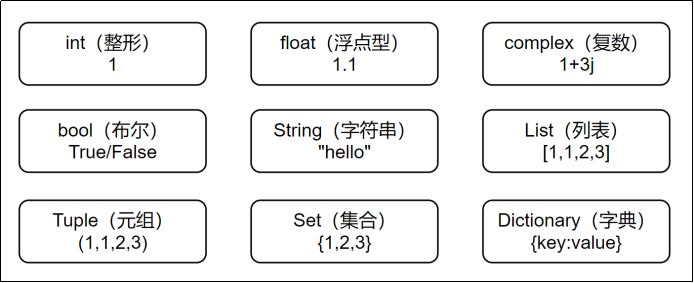

### 4.1 int 整型

- 支持任意大小整数，含负整数
- 大数字可加下划线分组（如 `1_000_000`），Python 忽略下划线
- 类型判断：`type()`（严格判断类型）、`isinstance()`（考虑继承，如 `bool` 是 `int` 子类）

示例：

```python
num1 = 1_000_000
print(num1)  # 输出1000000
print(isinstance(num1, int))  # 输出True
print(isinstance(True, int))  # 输出True
print(type(num1))  # 输出True
```

> **1）**小整数池
>
> Python将 [-5, 256] 的整数维护在小整数对象池中。这些整数提前创建好且不会被垃圾回收，避免了为整数频繁申请和销毁内存空间。不管在程序的什么位置，使用的位于这个范围内的整数都是同一个对象。
>
> **2）**大整数池
>
> 一开始大整数池为空，每创建一个大整数就会向池中存储一个。
>
> **注意事项**
>
> Ø 不同的 Python 实现：小整数池的范围和实现细节可能因 Python 的不同实现（如 CPython、Jython、IronPython 等）而有所不同。上述提到的[-5, 256]范围是 CPython 的默认实现。
>
> Ø 有时连续赋值的相同大整数也可能指向同一对象，这是因为Python环境的优化机制,但是这个优化不是绝对的，也取决于解释器以及交互式以及脚本环境。

### 4.2 float 浮点型

- 带小数点的数，计算可能有精度误差（可通过 `decimal` 模块解决）
- 支持科学计数法（如 `1.3e7` 表示 `13000000.0`）

```python
from decimal import Decimal
print(0.1 + 0.2)  # 输出0.30000000000000004
print(Decimal('1.0') - Decimal('0.9'))  # 输出0.1
```

### 4.3 bool 布尔型

- 只有 `True` 和 `False`（`True==1`，`False==0`，但 `is` 判断身份(即是否是同一个对象，是否在内存中占据相同的位置)）
- 被判断成假值的有：`None`、`0`、`0.0`、空容器（空列表 / 元组 / 字典等）、`False`

```python
print(True == 1)  # 输出True
print(True is 1)  # 输出False
print(bool([]))  # 输出False
```

### 4.4 str 字符串初识

- 用单 / 双 / 三引号包裹，支持转义字符

- 三引号支持多行字符串，保留格式，多用在代码片段的使用上

- 转义字符：

  | **转义字符** | **说明**         |
  | ------------ | ---------------- |
  | **\\**            | 在行尾作为续行符 |
  | **\\\\**      | 反斜杠符号       |
  | **\\'**      | 单引号           |
  | **\\"**      | 双引号           |
  | **\b**       | 退格             |
  | **\n**       | 换行             |
  | **\t**       | 横向制表符       |
  | **\r**       | 回车，回到行首   |


示例：

```python
print('hello')
print("world")
print('hello' + 'world')
print('========================')
print('\\')
print('\'')
print('\"')
print('\n')
print('\t')
print('========================')
print("""<div class="left-top">
        <a target="_blank" href="//www.bilibili.com/anime/">
            <div class="header-channel-fixed-right-item" style="letter-spacing: 2px;">番剧</div>
        </a>
        <a target="_blank" href="//www.bilibili.com/movie/">
            <div class="header-channel-fixed-right-item" style="letter-spacing: 2px;">电影</div>
        </a>
        <a target="_blank" href="//www.bilibili.com/guochuang/">
            <div class="header-channel-fixed-right-item" style="letter-spacing: 2px;">国创</div>
        </a>
        <a target="_blank" href="//www.bilibili.com/c/kichiku/">
            <div class="header-channel-fixed-right-item" style="letter-spacing: 2px;">鬼畜</div>
        </a>
    </div>""")
```


### 4.5 数据类型转换

1. **自动类型转换（隐式转换）**：

   - 不同数值类型运算时，小类型转大类型（如 `int + float = float`）
   - 整数除法结果为浮点数（如 `9 / 1 = 9.0`）
   - 整数与字符串无法隐式转换

2. **强制类型转换（显式转换）**：

   | 函数                          | 说明                               |
   | ----------------------------- | ---------------------------------- |
   | `int(x [,base])`              | 转整数（字符串可指定进制）         |
   | `float(x)`                    | 转浮点数                           |
   | `str(x)`                      | 转字符串                           |
   | `bin(x)`/`oct(x)`/`hex(x)`    | 转二进制 / 八进制 / 十六进制字符串 |
   | `ord(x)`/`chr(x)`             | 字符转 ASCII 码 / ASCII 码转字符   |
   | `list(s)`/`tuple(s)`/`set(s)` | 转列表 / 元组 / 集合               |

```python
num_int = 100
num_str = "100"
print("num_int 数据类型为:",type(num_int))
print("类型转换前，num_str 数据类型为:",type(num_str))
num_str = int(num_str) # 强制转换为整型
print("类型转换后，num_str 数据类型为:",type(num_str))
ascii_char = chr(97)
print(ascii_char)
```

### 4.6 字符的编码和解码

- 常见编码表

ASCII表，每个字符占用一个字节

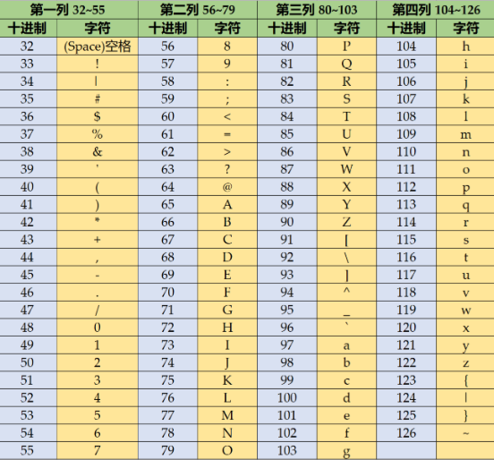

其他码表:

GBK/GB2312:中文国标(2个字节)

UTF-8:万国码(3个字节)

BIG-5:繁体大五码

ISO8859-1:拉丁标准码表，不含中文

- **编码与解码**

- **编码**：字符串 → 字节（`encode(encoding='utf8')`）
- **解码**：字节 → 字符串（`decode(encoding='utf8')`）
- 注意：编码和解码需用同一编码格式（如 utf8）

```python
str1 = "你好中国"
byte1 = str1.encode('utf8')
print(byte1)  # 输出b'\xe4\xbd\xa0\xe5\xa5\xbd\xe4\xb8\xad\xe5\x9b\xbd'
str2 = byte1.decode('utf8')
print(str2)  # 输出你好中国
```

## 5 输入与输出

### 5.1 输入

`input("提示信息")`：接收用户键盘输入，返回字符串。

```python
input_str = input("请输入：")
print(type(input_str))  # 输出<class 'str'>
```

### 5.2 输出

1. **普通输出**：

   - `print()` 打印内容，多内容用逗号分隔
   - end属性为结尾字符，默认是换行

2. **格式化输出**：

   | **格式符号** | **说明**                          |
   | ------------ | --------------------------------- |
   | **%d**       | 十进制整数                        |
   | **%f**       | 浮点数，%.nf可指定显示小数点后n位 |
   | **%s**       | 字符串                            |
   | **%o**       | 八进制整数                        |
   | **%x**       | 十六进制整数                      |
   | **%e**       | 科学计数法                        |

   示例：

   ```python
   a = 13
   b = 20.335
   print("整数a = %d, 小数b = %.2f" % (a, b))
   print("整数a = %d, 小数b = %.2f" % (a, b),end="haha")
   print("整数a = %d, 小数b = %.2f" % (a, b))
   ```

   - str.format()

     - 按顺序：`"{} {}".format(a, b)`
     - 指定位置：`"{0} {1}".format(a, b)`
     - 指定参数：`"{name} {age}".format(name="张三", age=18)`
     - 数字格式化：`"{:*^20,.2f}".format(31415.9)`（居中、补 *、千分位、保留 2 位小数）

     ```python
     # int1 = 100
     # float1 = 2.17828
     # bool1 = False
     # str2 = "int1 = {}, float1 = {}, bool1 = {}".format(int1, float1, bool1)
     # str2 = "int1 = {2}, float1 = {1}, bool1 = {0}".format(int1, float1, bool1)
     str2 = "int1 = {int1}, float1 = {float1}, bool1 = {bool1}".format(int1 = 100, float1 = 2.17828, bool1 = False)
     print(str2)
     
     num = 1234567.89
     # 格式化：居中、用*填充、总宽度20、千分位、保留2位小数
     result = "{:*^20,.2f}".format(num)
     print(f"原数字: {num}")
     print(f"格式化: '{result}'")
     print(f"结果类型: {type(result)}")
     ```

     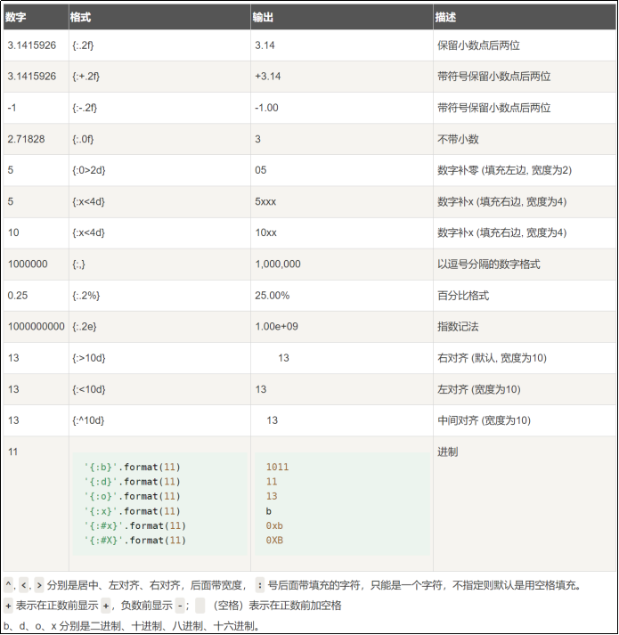

   - f - 字符串

     ```python
     int1 = 10
     float1 = 3.14159
     print(f"{int1}, {float1:.2f}")
     print(f"{int1 = }, {float1 = :.2f}")
     print(f"整数:{int1 = }, 小数:{float1 = :.2f}")
     ```

     

## 6 运算符

### 6.1 算数运算符

| 运算符 | 说明             | 示例         |
| ------ | ---------------- | ------------ |
| `+`    | 加               | `a + b`      |
| `-`    | 减 / 取负        | `a - b`/`-a` |
| `*`    | 乘               | `a * b`      |
| `/`    | 除（结果浮点）   | `a / b`      |
| `//`   | 整除（向下取整） | `a // b`     |
| `%`    | 模（余数）       | `a % b`      |
| `**`   | 幂               | `a ** b`     |

### 6.2 赋值运算符

| 运算符 | 说明               | 示例             |
| ------ | ------------------ | ---------------- |
| `=`    | 赋值               | `a = 1`          |
| `+=`   | 加法赋值           | `a += 2`         |
| `-=`   | 减法赋值           | `a -= 2`         |
| `*=`   | 乘法赋值           | `a *= 2`         |
| `/=`   | 除法赋值           | `a /= 2`         |
| `//=`  | 整除赋值           | `a //= 2`        |
| `%=`   | 模赋值             | `a %= 2`         |
| `**=`  | 幂赋值             | `a **= 2`        |
| `:=`   | 海象运算符（3.8+） | `(b := a+1) > 5` |

### 6.3 比较运算符

| 运算符 | 说明     | 示例     |
| ------ | -------- | -------- |
| `==`   | 相等     | `a == b` |
| `!=`   | 不相等   | `a != b` |
| `>`    | 大于     | `a > b`  |
| `<`    | 小于     | `a < b`  |
| `>=`   | 大于等于 | `a >= b` |
| `<=`   | 小于等于 | `a <= b` |

注：不同数据类型（如 int 和 str）不能比较大小；字符串比较按 ASCII 码逐字符比较。

### 6.4 逻辑运算符

| 运算符 | 说明                              | 示例      |
| ------ | --------------------------------- | --------- |
| `and`  | 与：x 假返回 x，否则返回 y        | `a and b` |
| `or`   | 或：x 真返回 x，否则返回 y        | `a or b`  |
| `not`  | 非：x 真返回 False，x 假返回 True | `not a`   |

注：非 0 为真，0 为假；非空容器为真，空容器为假。

### 6.5 位运算符（按补码运算）

| 运算符 | 说明     | 示例     |      |      |
| ------ | -------- | -------- | ---- | ---- |
| `&`    | 按位与   | `a & b`  |      |      |
| `      | `        | 按位或   | `a   | b`   |
| `^`    | 按位异或 | `a ^ b`  |      |      |
| `~`    | 按位取反 | `~a`     |      |      |
| `<<`   | 按位左移 | `a << 1` |      |      |
| `>>`   | 按位右移 | `a >> 1` |      |      |

### 6.6 成员运算符

| 运算符   | 说明                    | 示例               |
| -------- | ----------------------- | ------------------ |
| `in`     | 在序列中存在返回 True   | `1 in [1,2,3]`     |
| `not in` | 在序列中不存在返回 True | `4 not in [1,2,3]` |

### 6.7 身份运算符

| 运算符   | 说明                                              | 示例         |
| -------- | ------------------------------------------------- | ------------ |
| `is`     | 两个标识符引用同一对象返回 True（`id(a)==id(b)`） | `a is b`     |
| `is not` | 两个标识符引用不同对象返回 True                   | `a is not b` |

注：`==` 比较值，`is` 比较内存地址。

### 6.8 运算符优先级

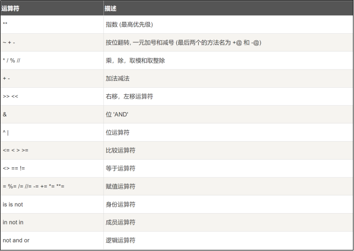

## 7 Python 编码规范（[PEP 8](https://peps.python.org/pep-0008/)）

1. **缩进**：4 个空格（禁用制表符，编辑器可设置制表符转空格）

2. **行长**：代码行≤79 字符，注释行≤72 字符

3. **空行**：用空行分隔程序不同部分，避免滥用

4. **语句**：不推荐同一行写多条语句（分号分隔）

5. **分号**：行尾不加，分号可分割同一行的多条命令

   ```python
   import sys;print(sys.path) #同一行多条语句
   ```

6. **编码**：Python3 源码用 UTF-8

7. **行尾空格**：禁止行尾留空格

## 8 流程控制

流程控制用于控制代码执行顺序，包括顺序、分支、循环。

### 8.1 顺序

按代码书写顺序依次执行（默认流程）。

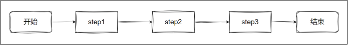

### 8.2 分支

通过条件判断执行不同代码块。

#### 8.2.1 单分支

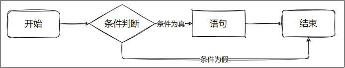

```python
if 表达式:
    语句  # 表达式为真时执行
# 其他代码
```

```python
from random import randint
age = randint(0, 100)
ageL = 18
print(f"年龄：{age}")
if age < ageL:
    print("不满18岁，禁止吸烟")
print("后续代码")
```


#### 8.2.2 双分支

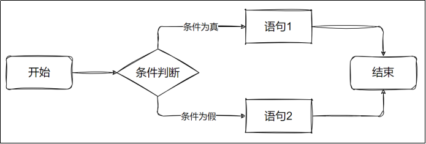

```python
if 表达式:
    语句1  # 表达式为真执行
else:
    语句2  # 表达式为假执行
```

```python
from random import randint
age = randint(0, 100)
ageL = 18
print(f"年龄：{age}")
if age < ageL:
    print("不满18岁，禁止吸烟")
else:
    print("欢迎光临")
print("后续代码")
```


#### 8.2.3 多分支

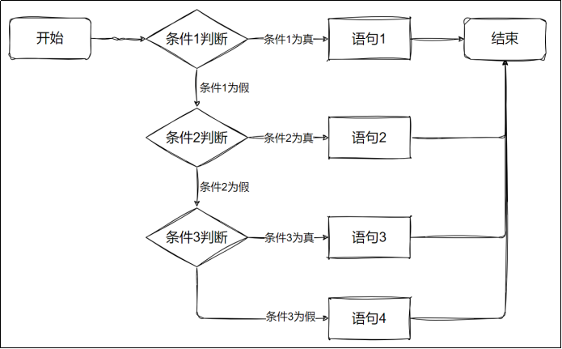


```python
if 表达式1:
    语句1
elif 表达式2:
    语句2
elif 表达式3:
    语句3
#...
else:
    语句n  # 所有表达式为假时执行
```

```python
age = int(input("请输入年龄："))
if 0 < age < 4:
    print("这是个婴儿,喝奶")
elif age < 20:
    print("这是个青少年,多吃点")
elif age < 60:
    print("这是个成年人,吃保健品")
elif age < 120:
    print("这是个老年人,想吃什么吃什么")
else:
    print("这是不是人？")
```


#### 8.2.4 嵌套分支

非新的语法知识,不再赘述

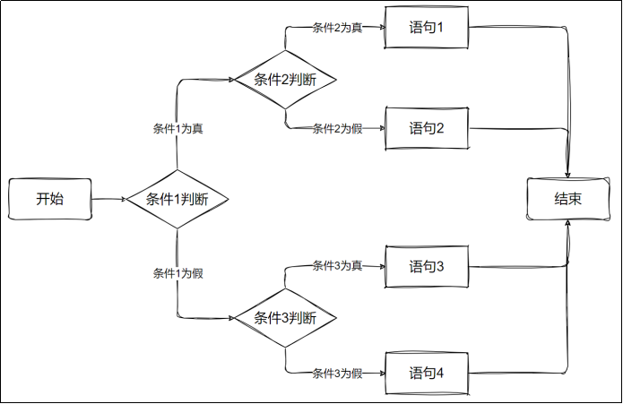

尝试完成以下需求：

​	产生随机0-100分。

​	0-59分		不及格

​	60-100分	   及格

​		60-69         及格水平

​                70-89         良好水平

​                90-100       优秀水平      

​	其他情况：数据出错                         

```python
import random

# 产生随机0-100分
score = random.randint(0, 100)
print(f"分数：{score}")

# 分数等级判断
if 0 <= score <= 59:
    print("不及格")
elif 60 <= score <= 100:
    print("及格")
    if 60 <= score <= 69:
        print("及格水平")
    elif 70 <= score <= 89:
        print("良好水平")
    elif 90 <= score <= 100:
        print("优秀水平")
else:
    print("数据出错")

```


#### 8.2.5 match case 语句（3.10+）

```python
match 变量:
    case 值1 | 值2:
        语句1
    case 值3:
        语句2
    case _:
        语句3  # 匹配所有未命中情况
```

```python
month = int(input("请输入月份："))

match month:
    case 12 | 1 | 2:
        print(f"{month}月是冬季")
    case 3 | 4 | 5:
        print(f"{month}月是春季")
    case 6 | 7 | 8:
        print(f"{month}月是夏季")
    case 9 | 10 | 11:
        print(f"{month}月是秋季")
    case _:
        print("输入的月份不存在")
```

#### 8.2.6 三元运算符

```python
表达式1 if 判断条件 else 表达式2  # 条件为真返回表达式1，否则返回表达式2
```

```python
num1 = 100
num2 = 200
max_num = num1 if num1 > num2 else num2
print(max_num)
```


### 8.3 循环

满足条件时重复执行代码块。

#### 8.3.1 while 循环

```python
while 表达式:
    循环体  # 表达式为真时重复执行
else:
    语句  # 循环正常结束（未被break终止）时执行
```

示例 1：循环1-5

```python
# 从 1 数到 5
count = 1
while count <= 5:
    print(count)
    count += 1
```


实例 2：模拟电池充电过程，每次充电1-5，0.4秒充一次，到100%结束

```python
import random
import time

# 模拟电池充电过程
battery_level = 0
while battery_level < 100:
    # 随机充电1-5电量
    charge_amount = random.randint(1, 5)
    battery_level += charge_amount
    battery_level = min(battery_level, 100)  # 确保不超过100%

    print(f"充电中... 当前电量: {battery_level}%")

    # 每0.4秒充电一次
    time.sleep(0.4)

    if battery_level >= 100:
        print("充电完成!")

```

示例 3：使用pygame库，画一进度条

```python
import pygame
import sys
import time

pygame.init()

screen_width = 600
screen_height = 400
screen = pygame.display.set_mode((screen_width, screen_height))
pygame.display.set_caption("10秒进度条")

# 颜色定义
WHITE = (255, 255, 255)
BLACK = (0, 0, 0)
BLUE = (0, 120, 255)
GREEN = (0, 255, 0)

# 尝试使用中文字体
try:
    font = pygame.font.SysFont("simhei", 36)  # 黑体
    small_font = pygame.font.SysFont("simhei", 24)
except:
    font = pygame.font.Font(None, 36)
    small_font = pygame.font.Font(None, 24)

# 进度条参数
progress_bar_x = 100
progress_bar_y = 180
progress_bar_width = 400
progress_bar_height = 30
current_progress = 0

start_time = time.time()
duration = 10

running = True
while running:
    for event in pygame.event.get():
        if event.type == pygame.QUIT:
            running = False

    elapsed_time = time.time() - start_time
    current_progress = min(elapsed_time / duration * 100, 100)

    screen.fill(WHITE)

    # 绘制进度条
    pygame.draw.rect(screen, BLACK, (progress_bar_x, progress_bar_y, progress_bar_width, progress_bar_height), 2)
    progress_width = int(progress_bar_width * current_progress / 100)
    pygame.draw.rect(screen, BLUE, (progress_bar_x, progress_bar_y, progress_width, progress_bar_height))

    # 显示中文文本
    progress_text = font.render(f"进度: {int(current_progress)}%", True, BLACK)
    screen.blit(progress_text, (progress_bar_x + progress_bar_width // 2 - 50, progress_bar_y - 40))

    time_text = small_font.render(f"时间: {min(elapsed_time, duration):.1f}/{duration}秒", True, BLACK)
    screen.blit(time_text, (progress_bar_x + progress_bar_width // 2 - 70, progress_bar_y + progress_bar_height + 20))

    if current_progress >= 100:
        complete_text = font.render("完成!", True, GREEN)
        screen.blit(complete_text,
                    (progress_bar_x + progress_bar_width // 2 - 30, progress_bar_y + progress_bar_height + 60))

    pygame.display.flip()
    pygame.time.Clock().tick(60)

pygame.quit()
sys.exit()
```


#### 8.3.2 for 循环

遍历可迭代对象（列表、字符串、range 等）：

```python
for 临时变量 in 可迭代对象:
    循环体
else:
    语句  # 循环正常结束时执行
```

（1）遍历列表

```python
numbers = [2, 3, 5, 7, 11, 13, 17, 19]
index = 0
for value in numbers:
    print(f"索引 {index}: {value}")
    index += 1

#enumerate枚举函数，可以帮助我们转成枚举类型数据，提供索引
for index, value in enumerate([2, 3, 5, 7, 11, 13, 17, 19]):
    print(f"索引 {index}: {value}")
```

（2）遍历字符串

```python
for i in "hello world":
	print(i)
```

（3）遍历range数列

```python
for i in range(10):
	print(i)

numbers = [2, 3, 5, 7, 11, 13, 17, 19]
for index in range(len(numbers)):
    print(f"索引 {index}: {numbers[index]}")
```

1. **range () 函数**：生成整数序列语法：`range([start,] stop[, step])`（start 默认 0，step 默认 1，可为负数，不包含 stop）

2. **嵌套循环**：循环内嵌套循环（如九九乘法表）：

   ```python
   for i in range(1, 10):
       for j in range(1, i + 1):
           print(f"{i} × {j} = {i * j}", end="\t")
       print()
   #end用于标记每次打印时结尾的标记，默认是换行
   ```


#### 8.3.3 continue

跳过当前循环剩余语句，直接进入下一轮循环。

示例1：

```python
for i in range(10):
    if i == 3:
        continue
    print(i)  
```

示例2:

有如下主题：posts = [
    "今天天气真好",
    "spam广告内容",
    "分享一个有趣的故事",
    "垃圾邮件推广",
    "Python编程技巧"
]
有如下禁用关键字：spam_keywords = ["spam", "广告", "垃圾"]

请过滤，即遍历所有主题，包含禁用关键字的不显示

```python
# 过滤不合适的帖子内容
posts = [
    "今天天气真好",
    "广告内容",
    "分享一个有趣的故事",
    "垃圾邮件推广",
    "Python编程技巧"
]

spam_keywords = ["广告", "垃圾"]

for post in posts:

    hasSpam = False
    # 判断是否包含敏感词
    for spam_keyword in spam_keywords:
        if spam_keyword in post:
            print(f"{post}含有垃圾词汇，予以过滤！")
            hasSpam = True

    if not hasSpam:
        print(f"本次主题:{post}")

```


```python
# 过滤不合适的帖子内容
posts = [
    "今天天气真好",
    "spam广告内容",
    "分享一个有趣的故事",
    "垃圾邮件推广",
    "Python编程技巧"
]
spam_keywords = ["spam", "广告", "垃圾"]

for post in posts:
    # 检查是否包含敏感词
    is_spam = any(keyword in post for keyword in spam_keywords)

    if is_spam:
        print(f"过滤垃圾内容: {post}")
        continue  # 跳过垃圾内容

    print(f"显示帖子: {post}")
"""
any() 函数用于检查可迭代对象中是否有任何一个元素为 True，这里简单了解，后边详细讲解。
意为遍历 spam_keywords 列表中的每个关键词，检查它是否出现在 post 字符串中，只要有一个关键词出现，any() 就返回 True，否则返回 False
"""
```

#### 8.3.4 break

终止当前循环（跳出循环体），循环的 else 语句不执行。

```python
for i in range(10):
    if i == 7:
        break
    print(i)  
```


#### 8.3.5 pass

空语句，仅占位（保持程序结构完整）。

示例：

```python
for i in range(10):
    pass  # 暂不执行任何操作，避免语法错误
```


练习题：

```
给定一个数字列表，统计每个数字范围内的数字个数：
0-20：低范围     21-50：中范围  51-80：高范围   81-100：超高范围
找出每个范围的最大值
numbers = [545,454,78,4,2,5,46,84,2,454,78,685,54,33,88,44]
```

```
给定一个商品列表，每个商品包含名称和价格，根据价格区间应用不同折扣：
价格 >=100:9折， 50-99：9.5折  20-49：9折  <20: 无折扣
输出格式：商品名称--原价--折后价
products = [
    ("笔记本电脑",8999),
    ("鼠标",169),
    ("键盘",29),
    ("U盘",69),
    ("耳机",19),
    ("据线",2)
]
```