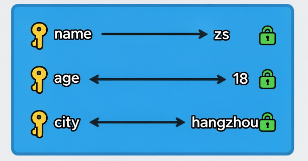

# 常用数据域

容器数据类型是 Python 中用于存储多个元素的数据结构，核心分为序列、集合、字典三大类，各自具备独特的特性和适用场景。本章将详细介绍列表、字符串、元组、集合、字典的定义、操作及常用功能，帮助高效处理批量数据。

## 1 序列

1） 什么是序列

序列是有序的元素集合，支持通过索引访问、切片等统一操作，核心包含列表（List）、元组（Tuple）、字符串（String）三种类型。

2） 序列的操作

- **索引**：通过 `sequence[index]` 访问元素，正向索引从 0 开始，反向索引从 - 1 开始。
- **切片**：通过 `sequence[start:end:step]` 截取部分元素，start 默认 0、end 默认序列长度、step 默认 1。
- **拼接**：使用 `+` 合并两个同类型序列，如 `[1,2] + [3,4]`。
- **重复**：使用 `*` 重复序列元素，如 `[1,2] * 3` 得到 `[1,2,1,2,1,2]`。
- **成员判断**：使用 `in`/`not in` 检查元素是否在序列中。
- **长度 / 最值**：通过 `len()`/`max()`/`min()` 获取序列长度、最大值、最小值。

## 2 列表 List

列表是**可变、有序**的元素集合，支持增删改查全操作，使用 `[]` 定义，元素间用逗号分隔，可存储不同类型数据。

### 2.1 创建列表

格式: 变量 = []

```python
# 直接创建
list1 = [100, "hello", True, 3.14]
# 空列表
empty_list = []
# 列表推导式（高效创建）
square_list = [x**2 for x in range(5)]  # [0, 1, 4, 9, 16]
```

### 2.2 访问与切片列表

访问：

​	格式: 列表变量[索引]

切片：

​	list1[初始索引:结束索引(不包含)]

```python
list1 = [100, 200, 300, 400, 500]
print(list1[2])       # 300（正向索引）
print(list1[-2])      # 400（反向索引）
print(list1[1:4])     # [200, 300, 400]（截取索引1-3）
print(list1[2:-1])    # 取索引从2开始到-1(不包含)的元素
print(list1[::-1])    # [500, 400, 300, 200, 100]（倒序）

print(list1)  # 取全部元素
print(list1[:])  # 复制整个列表
# 直接引用
list2 = list1
list2[0] = 999
print(list1)  # [999, 200, 300, 400, 500] - 原列表被修改
# 切片复制
list3 = list1[:]
list3[0] = 888
print(list1)  # [999, 200, 300, 400, 500] - 原列表未受影响
print(list3)  # [888, 200, 300, 400, 500] - 新列表被修改
```

### 2.3 增删改操作

#### 2.3.1 添加

追加：列表.append(元素)

插入：列表.insert(索引,元素)

合并：列表.extend(其他列表)

```python
list1.append(600)          # 末尾追加：[100,200,300,400,500,600]
list1.insert(2, 250)       # 指定位置插入：[100,200,250,300,400,500]
list1.extend([600, 700])   # 合并另一个序列：[100,200,300,400,500,600,700]
```

#### 2.3.2 **删除**

del 列表[索引]  删除指定位置索引

```python
del list1[3]               # 删除指定索引：删除400
list1.remove(200)          # 删除指定值（首次出现）
list1.pop()                # 弹出末尾元素：返回500
list1.pop(1)               # 弹出指定索引元素：返回200
list1.clear()              # 清空列表
```

#### 2.3.3 修改

列表[索引] = 新的值

列表[开始索引:结束索引] = [修改成的新元素] 

```python
list1[0] = -100            # 单个元素修改：[-100,200,300,400,500]
list1[1:3] = ["a", "b","c","d"]    # 切片修改：[100,"a","b","c","d",400,500]
```

### 2.4 遍历与推导式

#### 2.4.1 遍历

```python
list1 = [100, 200, 300, 400, 500]
# 直接遍历元素
for val in list1:
    print(val)
# 索引+元素遍历
for i in range(len(list1)):
    print(i, list1[i])
# 枚举遍历（推荐）
for i, val in enumerate(list1):
    print(i, val)
```

#### 2.4.2 推导式

列表推导式是 Python 中一种简洁创建列表的方式，它将一个可迭代对象（如列表、元组、集合、字符串等）的元素通过某种运算或条件筛选后生成一个新的列表

```python
# 立方列表
squares = [x**2 for x in range(5)]
print(squares)  # [0, 1, 4, 9, 16]
# 使用现有列表的列表推导式
list1 = [1, 2, 3, 4, 5]
squares = [x**2 for x in list1]
print(squares)  # [1, 4, 9, 16, 25]
# 带条件筛选
even_list = [x for x in range(10) if x % 2 == 0]  # [0,2,4,6,8]
# 多循环嵌套
cross_list = [(i,j) for i in [1,2] for j in ["a","b"]]  # [(1,"a"),(1,"b"),(2,"a"),(2,"b")]
```

### 2.5 其他

```python
#列表相加
list1 = [100, 200, 300]
list2 = ["a", "b", "c"]
print(list1 + list2)  # [100, 200, 300, 'a', 'b', 'c']
```

```python
#列表相乘
list1 = [100, 200, 300]
print(list1 * 2)  # [100, 200, 300, 100, 200, 300]

```

```python
#检查成员
list1 = [100, 200, 300]
print(100 in list1)  # True
```

```python
#获取长度
list1 = [100, 200, 300]
print(len(list1))  # 3
```

```python
#最值/求和
list1 = [100, 200, 300, 400, 500]
print(max(list1))  # 500
print(min(list1))  # 100
print(sum(list1))  # 1500
```

### 2.6 嵌套列表

逻辑嵌套，非新知识点，不再赘述

```python
list1 = [[1, 2, 3], [4, 5, 6], [7, 8, 9]]
for inner_list in list1:
    print(inner_list)
```

### 2.7 列表常用函数

| 函数                         | 说明                                                |
| ---------------------------- | --------------------------------------------------- |
| list.insert(index,x)         | 在指定位置插入 x                                    |
| list.append(x)               | 在列表末尾追加 x                                    |
| list1.extend(list2)          | 在列表 1 的末尾追加列表 2 的数据                    |
| del list[index]              | 删除指定位置的数据或切片                            |
| list.remove(x)               | 删除第一次出现的 x                                  |
| list.pop([index])            | 删除指定位置的数据，默认为末尾数据                  |
| list.clear()                 | 清空列表中元素                                      |
| list[index] = x              | 修改指定位置的数据                                  |
| list1[start:end] = list2     | 修改列表切片的数据                                  |
| sorted(list[,reverse=True])  | 返回排序后的新列表，可选降序                        |
| list.sort([reverse=True])    | 对列表就地排序，可选降序                            |
| list.reverse()               | 反转列表中的元素                                    |
| list.index(x[,start,[,end]]) | 返回 x 在列表中首次出现的位置，可指定起始和结束范围 |
| list.count(x)                | 返回 x 的数量                                       |
| len(list)                    | 返回列表元素个数                                    |
| max(list)                    | 返回列表中最大值                                    |
| min(list)                    | 返回列表中最小值                                    |
| sum(list)                    | 返回列表中所有元素和                                |
| list.copy()                  | 拷贝列表                                            |
| list(x)                      | 将序列转换为列表                                    |

## 3 字符串 String

- 字符串是**不可变、有序**的字符序列，使用单引号、双引号或三引号定义，支持序列通用操作，且有丰富的字符串专属方法。

### 3.1 基础操作

```python
str1 = "hello world"
print(str1[0])       # "h"（索引访问）
print(str1[6:11])    # "world"（切片截取）
print(str1 + "!")    # "hello world!"（拼接）
print(str1 * 2)      # "hello worldhello world"（重复）
print("world" in str1)  # True（成员判断）
```

### 3.2 常见方法

**修改大小写**

```python
print(str1.upper())      # 全大写："HELLO WORLD"
print(str1.lower())      # 全小写："hello world"
print(str1.title())      # 首字母大写："Hello World"
```

**查找与替换**

```python
print(str1.find("world"))  # 6（返回索引，不存在返回-1）
print(str1.replace("world", "python"))  # "hello python"
```

**分割与拼接**

```python
str1.split(" ")          # 按空格分割：["hello", "world"]
"-".join(["a", "b", "c"])# 拼接："a-b-c"
```

**去除空白**

```python
str2 = "  hello  "
print(str2.strip())      # 去除首尾空白："hello"
print(str2.lstrip())     # 去除左侧空白
print(str2.rstrip())     # 去除右侧空白
```

**原始字符串打印**

```python
print("hello\nworld")
print(r"hello\nworld")
```


### 3.3 常用函数

| 函数                            | 说明                                                         |
| ------------------------------- | ------------------------------------------------------------ |
| str.replace(old,new[,max])      | 把将字符串中的 old 替换成 new, 如果指定 max，则替换不超过 max 次 |
| str.split([x][,n])              | 按 x 分隔字符串，默认按任何空白字符串分隔并在结果中丢弃空字符串。可指定最大分隔次数 |
| str.rsplit([x][,n])             | 与 split () 类似，从右边开始分隔                             |
| x.join(seq)                     | 以 x 作为分隔符，将序列中所有的字符串合并为一个新的字符串    |
| str.strip([x])                  | 截掉字符串两边的空格或指定字符                               |
| str.lstrip([x])                 | 截掉字符串左边的空格或指定字符                               |
| str.rstrip([x])                 | 截掉字符串右边的空格或指定字符                               |
| str.removeprefix()              | 截掉字符串指定前缀                                           |
| str.removesuffix()              | 截掉字符串指定后缀                                           |
| str.upper()                     | 将所有字符转为大写                                           |
| str.lower()                     | 将所有字符转为小写                                           |
| str.swapcase()                  | 反转字符串中字母大小写                                       |
| str.capitalize()                | 将字符串第一个字母变为大写，其他字母变为小写                 |
| str.title()                     | 将字符串每个单词首字母大写                                   |
| str.casefold()                  | 返回适合无大小写比较的字符串版本                             |
| len(str)                        | 返回字符串长度                                               |
| max(str)                        | 返回字符串中最大值                                           |
| min(str)                        | 返回字符串中最小值                                           |
| str.find(x[,start][,end])       | 返回字符串中第一个 x 的索引值，不存在则返回 - 1，可指定字符串开始结束范围 |
| str.rfind(x[,start][,end])      | 与 find () 类似，从右边开始查找                              |
| str.index(x[,start][,end])      | 返回字符串中第一个 x 的索引值，不存在则报错，可指定字符串开始结束范围 |
| str.rindex(x[,start][,end])     | 与 index () 类似，从右边开始查找                             |
| str.count(x[,start][,end])      | 返回字符串中 x 的个数，可指定字符串开始结束范围              |
| str.startswith(x[,start][,end]) | 检查字符串是否以 x 开头，可指定字符串开始结束范围            |
| str.endswith(x[,start][,end])   | 检查字符串是否以 x 结尾，可指定字符串开始结束范围            |
| str.isspace()                   | 检查字符串是否非空且只包含空白                               |

### 3.4 其他函数

| 函数                                         | 说明                                                         |
| -------------------------------------------- | ------------------------------------------------------------ |
| str.center(width[,x])                        | 返回长度为 width 且居中的字符串，空白使用 x 填充，默认为空格 |
| str.ljust(width[,x])                         | 返回长度为 width 且左对齐的字符串，空白使用 x 填充，默认为空格 |
| str.rjust(width[,x])                         | 返回长度为 width 且右对齐的字符串，空白使用 x 填充，默认为空格 |
| str.zfill(width)                             | 返回长度为 width 且右对齐的字符串，空白使用 0 填充           |
| str.splitlines([keepends])                   | 按行分隔字符串，返回每行字符串组成的列表，可选是否保留换行符 |
| str.partition(x)                             | 使用 x 将字符串分隔为 3 部分，如果分隔后不足 3 部分或字符串中没有 x 则以空白填充 |
| str.rpartition(x)                            | 与 partition () 类似，从右边开始分隔                         |
| str.encode(encoding='UTF-8',errors='strict') | 对字符串使用指定格式编码，并指定错误处理方案                 |
| str.expandtabs([tabsize])                    | 将字符串中 \t 转化为空格，可指定每个 \t 空格数               |
| str.format_map(dict)                         | 使用字典等映射关系数据来格式化字符串                         |
| str.isalnum()                                | 检查字符串是否非空且只包含字母 (英文字母 + 汉字) 和数字      |
| str.isalpha()                                | 检查字符串是否非空且只包含字母 (英文字母 + 汉字)             |
| str.isascii()                                | 检查字符串是否只包含 ASCII 字符，空字符串也是 ASCII          |
| str.isdecimal()                              | 检查字符串是否非空且只包含十进制字符                         |
| str.isdigit()                                | 检查字符串是否非空且只包含数字                               |
| str.isidentifier()                           | 检查字符串是否是有效的标识符                                 |
| str.isupper()                                | 检查字符串中是否包含至少一个区分大小写的字符，且所有这些 (区分大小写的) 字符都是大写 |
| str.islower()                                | 检查字符串中是否包含至少一个区分大小写的字符，且所有这些 (区分大小写的) 字符都是小写 |
| str.isnumeric()                              | 检查字符串是否非空且只包含数值字符                           |
| str.isprintable()                            | 检查字符串是否可打印                                         |
| str.istitle()                                | 检查字符串是否非空且符合 title 格式                          |
| str.maketrans(str1,str2[,str3])              | 生成翻译表供 translate () 使用。如果只传一个参数，它必须是将 Unicode 序号（整数）或字符映射到 Unicode 序号、字符串或 None 的字典。然后，字符键将转换为序数。如果传两个参数，需要 str1 和 str2 为等长的字符串，并且在生成的字典中，str1 中的每个字符都将映射到 str2 中相同位置的字符。如果有第三个参数，它必须是一个字符串，其字符将在结果中映射到 None |
| str.translate()                              | 使用给定的翻译表替换字符串中的每个字符                       |

## 4 元组 Tuple

元组是**不可变、有序**的元素集合，使用 `()` 定义（单个元素需加逗号），特性与列表类似，但无法修改元素，安全性更高。

### 4.1 创建元组

```python
# 直接创建
tuple1 = (100, 200, 300)
# 单个元素（必须加逗号）
single_tuple = (50,)
# 空元组
empty_tuple = ()
# 元组推导式（需转换为元组）
tuple_gen = (x for x in range(3))
tuple2 = tuple(tuple_gen)  # (0,1,2)
```

### 4.2 核心操作

```python
tuple1 = (100, 200, 300, 400)
print(tuple1[2])       # 300（索引访问）
print(tuple1[1:3])     # (200, 300)（切片）
print(tuple1 + (500,)) # (100,200,300,400,500)（拼接）
print(200 in tuple1)   # True（成员判断）
print(tuple1 * 2)      # (100, 200, 300, 400,100, 200, 300, 400)
print(len(tuple1))     # 4
# 遍历方式与列表一致
```

### 4.3 元组的不可变

元组的不可变指的是元组所指向的内存中的内容不可变，但可以重新赋值。

```python
tuple1 = (100, 200, 300)
print(id(tuple1), tuple1)
tuple1 = tuple1 + (1, 2, 3)
print(id(tuple1), tuple1)

#以下操作是否可执行？：
tuple2 = (1, [2, 3])
tuple2[1].append(4)    
tuple2[0] = 5         
```

## 5 集合 Set

集合是**可变、无序、无重复**的元素集合，使用 `{}` 或 `set()` 定义，适用于去重、快速数据判断等集合运算场景,因为没有索引，所以不能使用索引或切片访问。

### 5.1 创建集合

可以通过 {} 或 set () 创建集合，但创建空集合需要使用 set () 而非 {}，因为 {} 会创建空字典。

```python
# 直接创建（自动去重）
set1 = {1, 2, 2, 3}  # {1,2,3}
# 空集合（必须用set()）
empty_set = set()
# 从列表转换
set2 = set([3,4,5])  # {3,4,5}
# 集合推导式
even_set = {x for x in range(10) if x % 2 == 0}  # {0,2,4,6,8}
```

### 5.2 增删操作

```python
set1 = {1,2,3}
# 添加元素
set1.add(4)            # {1,2,3,4}
set1.update([5,6])     # {1,2,3,4,5,6}（批量添加）
# 删除元素
set1.remove(3)         # 删除指定元素，不存在报错
set1.discard(7)        # 删除指定元素，不存在不报错
set1.pop()             # 随机删除一个元素
set1.clear()           # 清空集合
```

### 5.3 集合运算

```python
a = {1,2,3,4}
b = {3,4,5,6}
print(a | b)  # 并集：{1,2,3,4,5,6}
print(a & b)  # 交集：{3,4}
print(a - b)  # 差集：{1,2}（a中有b中无）
print(a ^ b)  # 对称差：{1,2,5,6}（互不包含的元素）
```

### 5.4 常用函数

| 函数                                   | 说明                                                         |              |
| -------------------------------------- | ------------------------------------------------------------ | ------------ |
| set.add(x)                             | 添加元素                                                     |              |
| set.update(x)                          | 添加元素，x 可以为列表、元组、字符串、字典等可迭代对象       |              |
| set.union(x)                           | 添加元素后返回一个新的集合，x 可以为列表、元组、字符串、字典等可迭代对象 |              |
| set.remove(x)                          | 从集合中移除 x，x 不存在则报错                               |              |
| set.discard(x)                         | 从集合中移除 x，x 不存在也不报错                             |              |
| set.pop()                              | 随机取出集合中的一个元素，如果集合为空则报错                 |              |
| set.clear()                            | 清空集合                                                     |              |
| set.difference(x1,...)                 | 求 set1 和 x1 的差集，返回一个新的集合                       |              |
| set.difference_update(x1,...)          | 求 set1 和 x1 的差集                                         |              |
| set.intersection(x1,...)               | 求 set1 和 x1 的交集，返回一个新的集合                       |              |
| set.intersection_update(x1,...)        | 求 set1 和 x1 的交集                                         |              |
| set1 & set2                            | 两集合求交集                                                 |              |
| set1                                   | set2                                                         | 两集合求并集 |
| set1 - set2                            | 两集合求差集                                                 |              |
| set1.isdisjoint(set2)                  | 判断两集合是否没有交集                                       |              |
| set1.issubset(set2)                    | 判断 set1 是否为 set2 的子集                                 |              |
| set1.issuperset(set2)                  | 判断 set2 是否为 set1 的子集                                 |              |
| set1.symmetric_difference(set2)        | 求两集合中不重复的元素，返回一个新的集合                     |              |
| set1.symmetric_difference_update(set2) | 求两集合中不重复的元素                                       |              |
| set.copy()                             | 拷贝集合                                                     |              |
| len(set)                               | 返回集合元素个数                                             |              |
| max(set)                               | 求集合中元素的最大值                                         |              |
| min(set)                               | 求集合中元素的最小值                                         |              |
| sum(set)                               | 求集合中元素的加和                                           |              |


## 6 字典 Dictionary

字典是**可变、无序**的键值对（key-value）集合，使用 `{key:value}` 定义，key 唯一且不可变（字符串、数字、元组），value 可任意类型，查询效率极高。



### 6.1 创建字典

可以通过 {} 或 dict () 创建字典。

```python
# 直接创建
dict1 = {"name": "limei", "age": 18, "gender": "female"}
# 空字典
# empty_dict = dict()
empty_dict = {}
# 关键字创建
dict2 = dict(name="wanglei", age=20)
# 列表转字典
dict3 = dict([("name", "yangmeimei"), ("age", 22)])
# 字典推导式
square_dict = {x: x**2 for x in range(4)}  # {0:0, 1:1, 2:4, 3:9}
```


### 6.2 访问字典

可通过 [] 访问字典中的元素。key 不存在时会报错。

也可以通过 get () 获取字典中的元素。key 不存在时会返回 None，也可以指定默认值。

```python
print(dict1["key"])  
print(dict1.get("key"))
print(dict1.get("key","默认值"))
```


### 6.3 **增删改**操作

为字典指定的 key 赋值 value，若 key 原本不存在则会被添加，有则会进行覆盖操作（修改）

```python
dict1 = {}
# 添加/修改key-value
dict1["address"] = "Beijing"  # 添加新键值对
dict1["age"] = 19            # 修改已有key的值
# 删除key-value
del dict1["gender"]          # 删除指定key
dict1.pop("age")             # 弹出key，返回value
dict1.clear()                # 清空字典
```


### 6.4 其他操作

```python
print("XXX" in dict1)  # 检查key是否存在
print(len(dict1))      # 获取的键值对数
```


### 6.5 遍历字典

```python
dict1 = {"name": "Alice", "age": 18, "gender": "female"}
# 遍历key
for key in dict1.keys():
    print(key)
    
# 遍历value
for val in dict1.values():
    print(val)
    
# 遍历key-value
for key in dict1.keys():
    print(f'{key}---{dict1[key]}')
    
# 遍历key-value（推荐）
for key, val in dict1.items():
    print(key, val)
```


### 6.6 常用函数

| 函数                           | 说明                                                         |
| ------------------------------ | ------------------------------------------------------------ |
| del dict[key]                  | 根据 key 删除键值对                                          |
| dict.pop(key[,default])        | .获取 key 所对应的 value，同时删除该键值对，可设置默认值     |
| dict.popitem()                 | 取出字典中的最后插入的键值对，字典为空则报错                 |
| dict.clear()                   | 清空字典                                                     |
| dict1.update(dict2)            | 将 dict2 中的键值对更新到 dict1 中                           |
| dict.get(key[,default])        | 获取字典中 key 对应 value，可设置默认值                      |
| dict.setdefault(key[,default]) | 获取字典中 key 对应 value，可设置默认值。若 key 不存在于字典中，将会添加 key 并将 value 设为默认值 |
| dict.keys()                    | 获取字典所有的 key，返回一个视图对象。字典改变，视图也会跟着变化 |
| dict.values()                  | 获取字典所有的 value，返回一个视图对象                       |
| dict.items()                   | 获取字典所有的 (key,value)，返回一个视图对象                 |
| dict.copy()                    | 拷贝字典                                                     |
| dict.fromkeys(seq[,default])   | 以序列 seq 中元素做字典的 key 创建一个新字典，可设置 value 的默认值 |

## 7 列表、元组、字典和集合的区别

| 数据结构           | 是否可变 | 是否有序         | 是否可重复       | 定义符号      | 核心用途                             |
| ------------------ | -------- | ---------------- | ---------------- | ------------- | ------------------------------------ |
| 列表（List）       | 是       | 是               | 是               | `[]`          | 动态存储多个元素，增删改频繁场景     |
| 字符串（String）   | 否       | 是               | 是               | 单双三引号    | 存储文本信息                         |
| 元组（Tuple）      | 否       | 是               | 是               | `()`          | 存储固定数据，保障安全性（如配置项） |
| 集合（Set）        | 是       | 否               | 否               | `{}`/`set()`  | 去重、集合运算、元素存在性判断       |
| 字典（Dictionary） | 是       | 否（3.7 + 有序） | key 否 /value 是 | `{key:value}` | 键值映射查询（如用户信息、配置表）   |

选择建议：

- 需动态增删改、有序存储 → 列表
- 文本处理、不可修改 → 字符串
- 固定数据、需安全传输 → 元组
- 去重、元素关系判断 → 集合
- 键值查询、高效检索 → 字典

以下是在具体业务场景中选择合适Python容器类型的建议：

> 列表(List) - 动态有序数据管理

- **购物车商品管理**: 支持添加、删除、修改商品顺序
- **用户操作历史记录**: 按时间顺序存储用户行为
- **待办事项清单**: 动态增删任务项

> 字符串(String) - 文本处理场景

- **日志数据分析**: 处理系统日志文本内容
- **用户输入验证**: 检查邮箱、手机号等格式
- **文档内容处理**: 文本搜索、替换等操作

> 元组(Tuple) - 固定数据结构

- **地理坐标存储**: `(纬度, 经度)` 形式的坐标点
- **数据库记录**: 不变的用户基本信息 `(ID, 姓名, 注册时间)`
- **配置参数**: 应用程序的固定配置项

> 集合(Set) - 去重和关系运算

- **用户权限管理**: 去除重复权限，计算用户权限交集
- **标签系统**: 文章标签去重处理
- **社交网络好友关系**: 查找共同好友、去重好友列表

> 字典(Dictionary) - 键值映射查询

- **缓存系统**: `{键: 值}` 形式的快速数据访问
- **用户信息存储**: `{"user_id": 123, "name": "张三", "age": 25}`
- **配置管理**: `{配置项: 配置值}` 的灵活配置系统